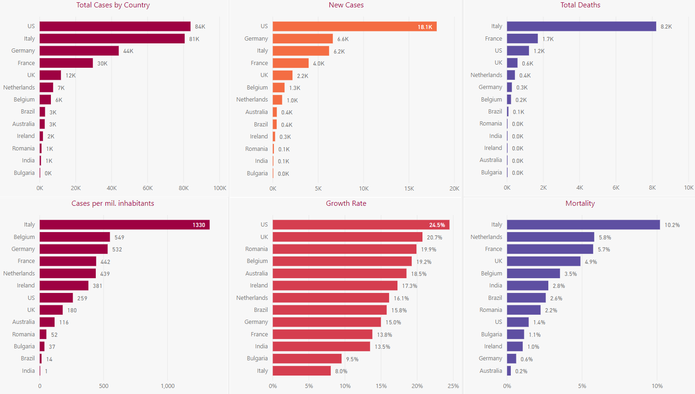

# Covid Situation Report (PowerBI)

## Intro

Since media channels are overflown with news on the COVID-19 virus it's harder and harder to see the forest from the trees so I put together my own Bi report. The report is mostly based on the "famous" dataset from the John Hopkins University and as such the data can be up to one day old.

## Screenshots

## Description

| **Section** | **Description** | **Comments** |
|-------------|-----------------|--------------|
| Trend Overview |  Overview of latest trends for (select) countries |
| Trend Details | Some details on the same data |
| Country Rank | Select countries ranked by different measures |
| Country Table | Table ranking countries by same measures |
| Country Map | Map visualization of select countries by reported cases |
| World | Map and table visualization of world wide cases |
| Italy | |
| Ireland | |
| France | |
| Romania | |
| US | |
| WIP | Work in progress visualization(s) |

## Data Sources

| **Data Source** | **Description** | **URL** |
|-----------------|-----------------|---------|
| JHU CSSE | Data repository for the 2019 Novel Coronavirus Visual Dashboard operated by the Johns Hopkins University | [GitHub CSV Files](https://github.com/CSSEGISandData/COVID-19/tree/master/csse_covid_19_data/csse_covid_19_time_series) |

## Inspiration